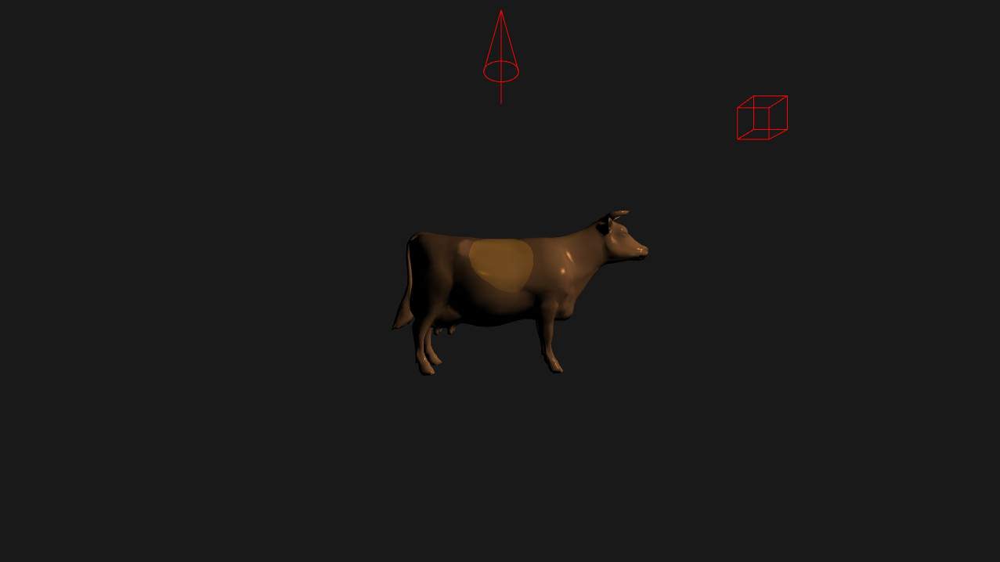

### Controls

* Hold down the left mouse button and drag to pan horizontally (X-axis direction).
* Hold down the right mouse button and drag to pan vertically (Y-direction).
* Scroll the mouse wheel for Z-direction panning.
* Holding down the right mouse button and dragging horizontally will perform a Yaw rotation.
* Holding down the right mouse button and dragging vertically will perform a Pitch rotation.
* Holding down the left and right arrow keys will perform Roll rotation.
* The R key resets all translations and rotations.

### Implementation Details

#### (a) Drawing the cow using perspective projection

The get_vertices() and get_faces() functions provided by cow.js can get the vertices and indexes of the cow model, according to the vertices and indexes you can create VBOs and EBOs, which can be drawn using the gl.drawElements function.

Further using the vector and matrix functions provided by MV.js, we are able to create the view (lookAt() function) and perspective projection (perspective() function) matrices, set the model, view, projection matrices of the model through the gl.uniform4fv function, which is passed to the vertex shader to transform the vertices.

#### (b) Interactively translating the cow

To translate the model, you can use the translate() function provided by MV.js, which will generate a translation matrix.

#### (c) Interactively rotating the cow

To rotate a model you can use the rotate() function provided by MV.js. The first parameter of the function is the rotation angle in degrees and the second parameter is the rotation axis.

#### (d) Draw an auto rotating point light as a wireframe cube

To rotate the wireframe cube around the center, you can first apply the translation (8,5,5) required by the title to it, and then apply the rotation matrix around the Y-axis.

#### (e) Draw an auto panning spotlight as a wireframe cone

To draw a wireframe cone you can draw a circle in the X-Z plane, then draw two straight lines from a point on the Y-axis as the hypotenuse of the cone, and then draw a straight line through the center of the circle to draw the cone shown in the document.

The back-and-forth translation of the wireframe cone takes advantage of the periodicity of the Math.sin function, which takes as its argument the time that has elapsed since the start of the page load.

#### (f) Phong reflection

To implement the lighting model, first we need to compute the normals of each vertex based on the provided vertices and indices, and then apply the classical Phong reflection model for Specular.

Specular = pow(max(dot(r, v), 0.0),  shininess)

Where r is the reflection vector of the light vector l with respect to the normal n, obtained by reflect(-l, n), v is the vector of vertex world coordinates toward the viewpoint position, and shininess controls the intensity of the highlights.

#### (g) Phong shading

Phong shading achieves a smoother effect than Gourand shading by performing lighting calculations in the fragment shader via interpolated normals and world coordinates.

#### (h) Tuning the light and material parameters

By adjusting the color and intensity of the light, you can get a final effect similar to the one in the document.

